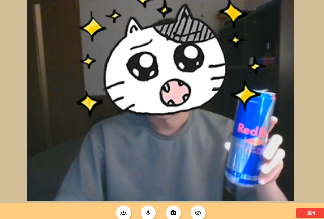
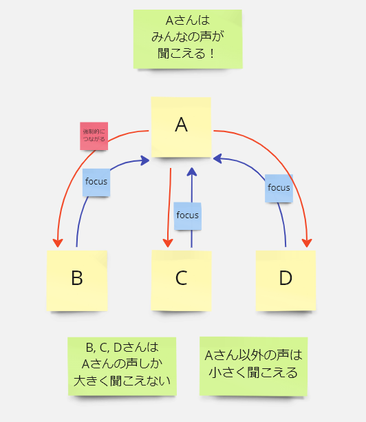
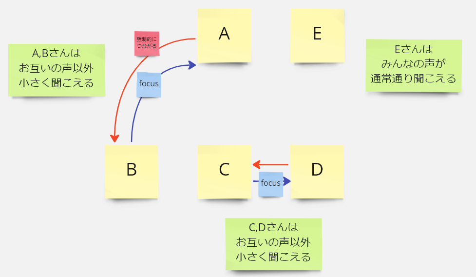
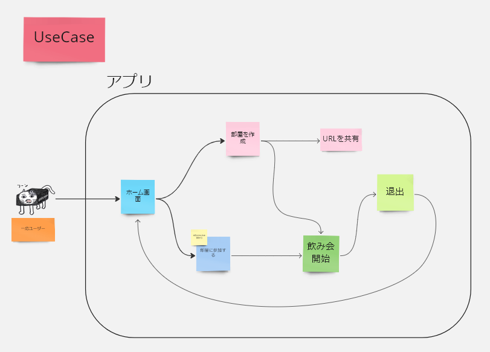
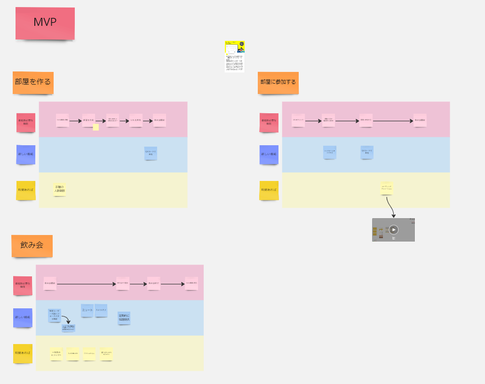
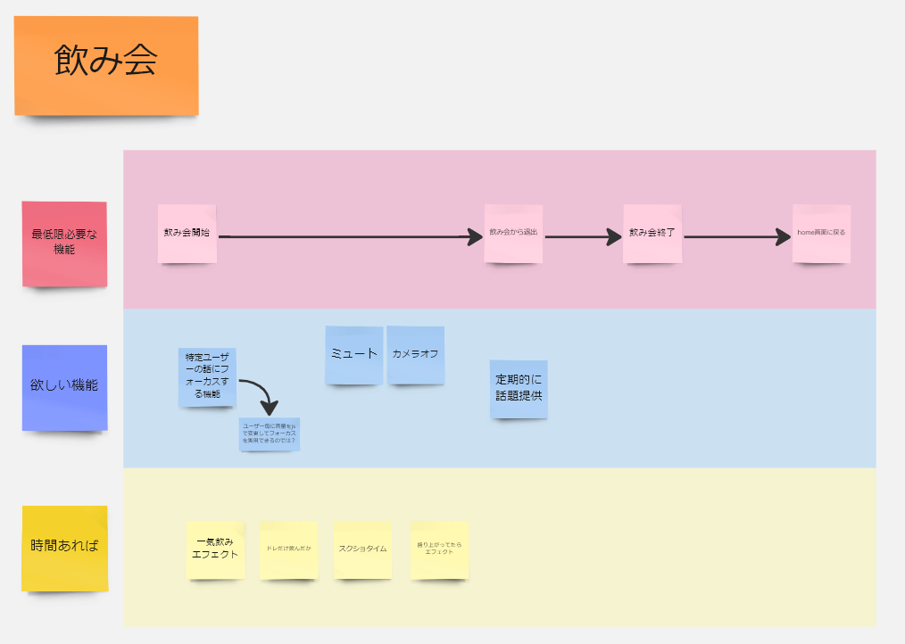
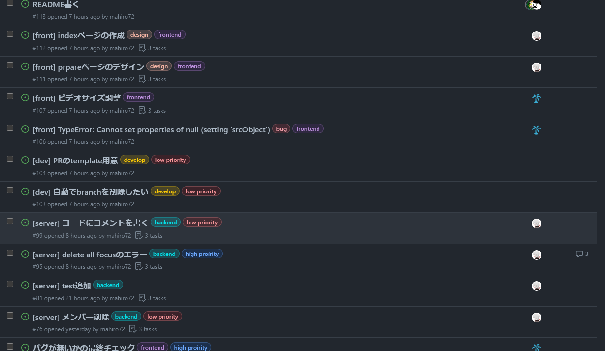
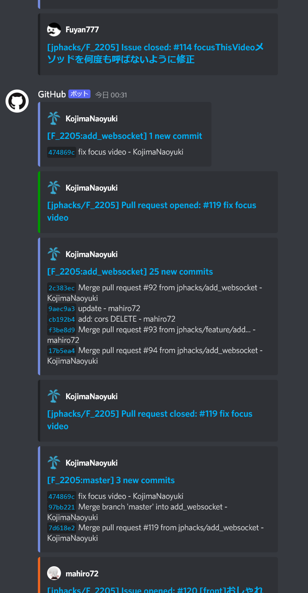

# のみぱら 🍺

 

## 🎥 作品紹介動画
https://www.youtube.com/hogehoge

 

## ✨ 作品URL
https://jphacks-app.herokuapp.com/room/prepare

 

## 💪 製品概要

オンライン飲み会に最適化された新しいビデオ通話サービスです！

オンライン飲み会の課題を解決し、快適なオンライン飲み会体験を提供します。

 

### 🔥 背景 (製品開発のきっかけ、課題等)

皆さん、大人数での飲み会は好きですか？🍻

対面での飲み会は、いろんな人同士がさまざまな話題でグループを作って会話を楽しんでいました。

 

しかし、オンライン飲み会では、「**複数人が平行して会話することができない**」という大きな課題があります。

平行して会話ができないと以下のようなデメリットがあります。

- 大勢参加者がいたとしても、話す話題が一つになり、平行して会話を進めることができない
  - ルームの参加者が強制的に発言者の話題に縛られてしまう
- 話すタイミングを見失う
  - 同時に話し始めると気まずい
  - 誰かが話し始めるのを待って沈黙の時間が続く
    - 悪魔の沈黙、誰か話してくれーー😢
- ほかの参加者に気を使って好きな話題を話すことができない
  - 多くの人がわからない推しの技術など
    - 自分はクリーンアーキテクチャの話が好きです👀 @mahiro72

 

対面時のように複数人が平行して会話することが難しいのです。

 

そこで私たちは、上記の悩みを解決し、

オンライン飲み会をさらに楽しくするサービス、「のみぱら🍺」を開発しました。

 

<!-- TODO 使うか検討 -->
<!-- #### 【 開発のきっかけ✨ 】 飲み会は「人と人との繋がり」を作ることができる

コロナ渦になり、人との交流が難しい社会情勢になってしまいました。

特に大人数での飲み会は感染リスクが高く自粛されることが多いでしょう。 

そして、オンラインでの飲み会は人数が増えるほど盛り上がるのが難しいことが多いです。

ですが、飲み会は「人と人との繋がり」を作るのにとても有用です。

そこで、飲み会をオンラインでも対面と変わらない感覚で楽しめるサービスが必要だと考え、開発しました。

  -->

### 📝 製品説明（具体的な製品の説明）

既存のビデオ通話機能に加え、一つのビデオ通話にいながら、平行して別々の話題で会話することができるサービスです！

また、視線トラッキングを活用することでより対面でのオンライン飲み会体験に近づけています。

 

#### 使い方

大きく分けて３つのステップです。

1. 部屋を作成する

   [こちら](https://jphacks-app.herokuapp.com/room/prepare) からroom作成ページにアクセスし、好きな部屋番号を入力します (例:1111)

   入力したら作成ボタンを押して、部屋を作成します。

   ※下の写真はレッドブルを持っていますが、このサービスはビールが推奨です。

   

 

2. 部屋番号を参加者に共有する

   部屋を作成する際に入力した番号を、参加者に共有します。

   参加者は[こちら](https://jphacks-app.herokuapp.com/room/prepare)にアクセスし、部屋番号を入力して参加を押します。

3. オンライン飲み会を楽しむ！🍻
   
   あとは楽しむだけです！！

<!-- TODO 写真！！！ -->

 

#### フォーカス機能の使い方

hogehoge

 

余談ですが

のみぱらの、のみは飲み会の、のみですが、ぱらには２つの意味があります。

１つめは、parallel(平行)のぱらです。
平行して会話ができるサービスなので、パラレルのぱらを使いました。

２つめは、パラダイスのぱらです。
パラダイスは楽園などの意味があります。

ようは**思いっきり楽しんで飲み会をしましょう**ということです！！🍻

 

### 🥳 特長

#### 1. 一つのビデオ通話にいながら、別々の話題で会話することができる

<!-- TODO 写真欲しいな -->

 

#### 2. 視線操作で会話する相手を選択する

<!-- TODO 写真欲しいな -->

 

#### 3. 特長 3

<!-- TODO 写真欲しいな -->

 

### ✅ 解決出来ること

<!-- TODO 書き方がいまいちなので直したい -->

- 1つのビデオ通話にいながら平行して会話し、参加者みんなが盛り上がることができる！
- 視線を計測し、現実の飲み会のように自分がみているユーザーの声が大きく聞こえる！
- 自分の声は、一部のユーザー同士にしか大きく聞こえないようにできるため、好きな話題を好きなだけ話せる！
- オンライン飲み会をより楽しめるサービスを提供し、人とのつながりの機会を提供する！

 

### ✨ 今後の展望

私たちの作った**のみぱら🍺**は既存の課題であった「**平行して会話することができないこと**」を解決しました。

そこで次の目標となるのは、さらに楽しいオンライン飲み会プラットフォームを提供することです。

具体的には、オンライン飲み会をさらに盛り上げるため、以下の機能を実装します。

- チャット機能
  - ユーザー同士のチャット用
  - 定期的に話題を提供するbotの導入
- スクショ機能
  - スクショ時にエフェクトをつけて、飲み会が盛り上がっている様子を演出する
- 飲みすぎパラメータ
  - お酒を飲む動作をした場合、ゲージが上昇していき、飲みすぎてないか常に確認できる
  - 逆に飲んでない人もわかりますが、アルハラしないように気を付けましょう⚠️
- 一気飲みエフェクト
  - お酒を飲む動作をした場合、そのユーザーに盛り上がっているエフェクトがつく
    - エフェクトが付きますが、お酒に強くなったわけではありません
    - お酒は楽しんで飲みましょう！🍻

 

### 😆 注力したこと（こだわり等）

<!-- TODO もっとしっかりかく -->
- 視線まわり
- ビデオ通話
- websocketでよりリアルタイムな通信

  

## 開発技術

### アーキテクチャ

 

### 活用した技術

#### API・データ

<!-- TODO 説明入れる -->
- SkyWay

 

#### フレームワーク・ライブラリ・モジュール

- フロントエンド
  - Nuxt.js
    - HTML,SCSS
    - JavaScript
  - Prettier
  - vuetifyjs
- サーバーサイド
  - Golang
  - [gorilla/websocket](https://github.com/gorilla/websocket)
  - [gin-gonic/gin](https://github.com/gin-gonic/gin)
- インフラ
  - 開発環境
    - Docker / Docker Compose
  - 本番環境
    - フロントエンド
      - Heroku
    - サーバーサイド
      - GCP
      - Cloud Run
      - Cloud Build
- CI/CD
  - GitHub Actions
  - heroku
  - Cloud Run / Cloud Build / Container Registry
- 開発環境整備
  - Make

 

#### デバイス

- PC (google chrome 推奨)

 

### 独自技術

#### ハッカソンで開発した独自機能・技術

##### フロントエンド

- 独自で開発したものの内容をこちらに記載してください
- 特に力を入れた部分をファイルリンク、または commit_id を記載してください。

 

##### フォーカス機能

フォーカス機能はユーザー同士を接続する機能です。

 

下記の図のように、

BさんからAさん、CさんからAさん、DさんからAさんにfocusのリクエストを送ると、

AさんとBさん、CさんとAさん、DさんとAさん、それぞれが接続している状態になります。

このとき、Aさんは全員と接続しているのでB,C,Dさんの声が通常通り聞こえますが、

B,C,DさんはAさんの声以外、小さく聞こえるようになります。

 

このように、誰かをフォーカスすることで、
その対象のユーザーと強制的にお互いにフォーカスしあっている状態とする機能がフォーカス機能です。

 

この機能を使うことで、
話したいユーザー以外の声を小さくし、好きな話題をそれぞれが平行して会話できる環境ができます。

 

つづいて具体例をみます。

この場合、AさんとBさんはお互いにフォーカスしあっており、
また、CさんとDさんもお互いにフォーカスしあっています。

このとき彼らはお互いの声以外は小さく聞こえており、
自分たちの好きな話題に集中して会話できます。

Eさんはだれともフォーカスしあってないので、
参加者全員の声が通常の大きさで聞こえます。

 

<!-- TODO どこで実装されているか -->

<!-- TODO ほかにあれば追加する！ -->

 

 

#### 製品に取り入れた研究内容（データ・ソフトウェアなど）（※アカデミック部門の場合のみ提出必須）

- hogehoge @やまじゅん が書いてくれるらしい
- ...
- ...

 

### プロダクト開発

#### MVP,Usecaseの検討

私たちのチームはMiroで事前にMVPやUsecaseを検討したことで、

必要な機能をしっかりと選定したうえで開発を進めることができました。

 

#### デザイン

また、Figmaを用いてデザインを行い、

チーム内でのプロダクトのデザインの共通認識を行ってスムーズに開発を進めました。

 

#### タスク管理

私たちのチームではタスクをISSUEで管理していました。

ISSUEのラベルを使うことで、タスクの優先度や分野について、わかりやすいように工夫しました。

 

#### 作業・進捗管理

Discordのボットを利用することで、

誰が今どの作業をしているのかを全体で共有しました。

 

### Miro

この [miro.md](./doc/miro.md) にmiroに書いた設計などをまとめてあります。